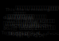
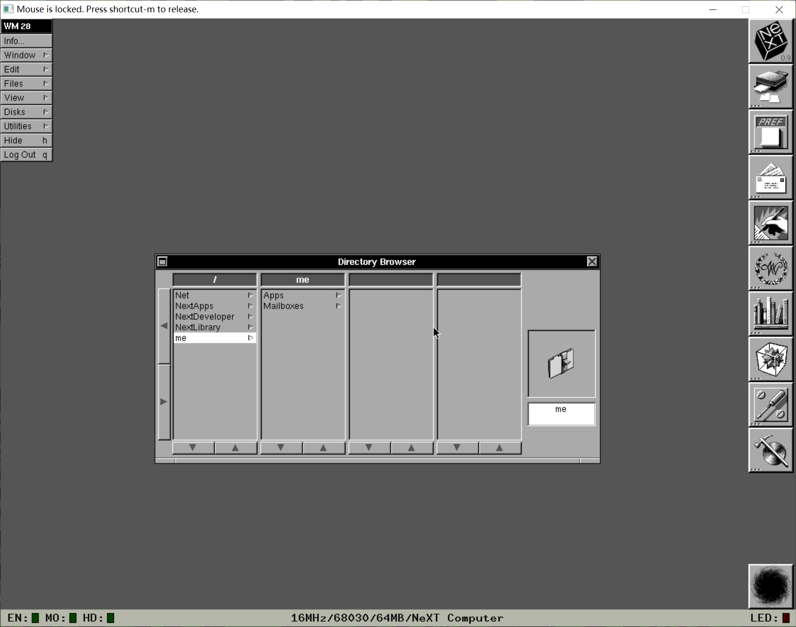
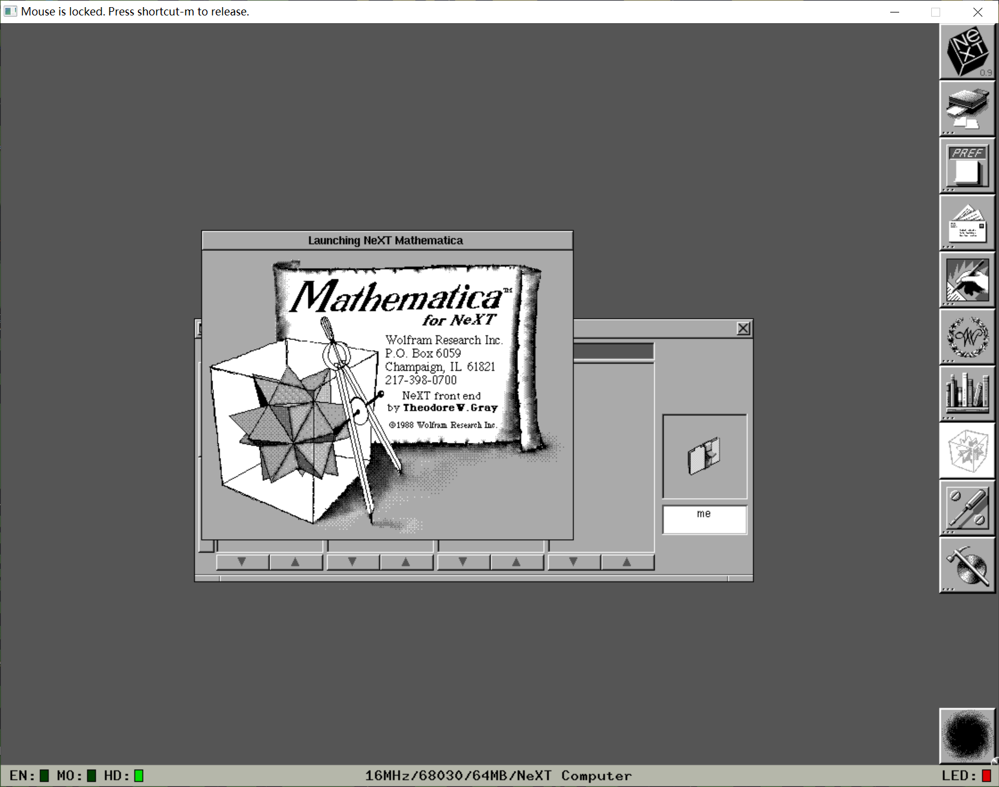
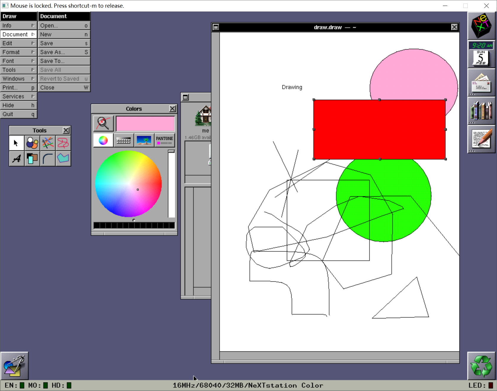
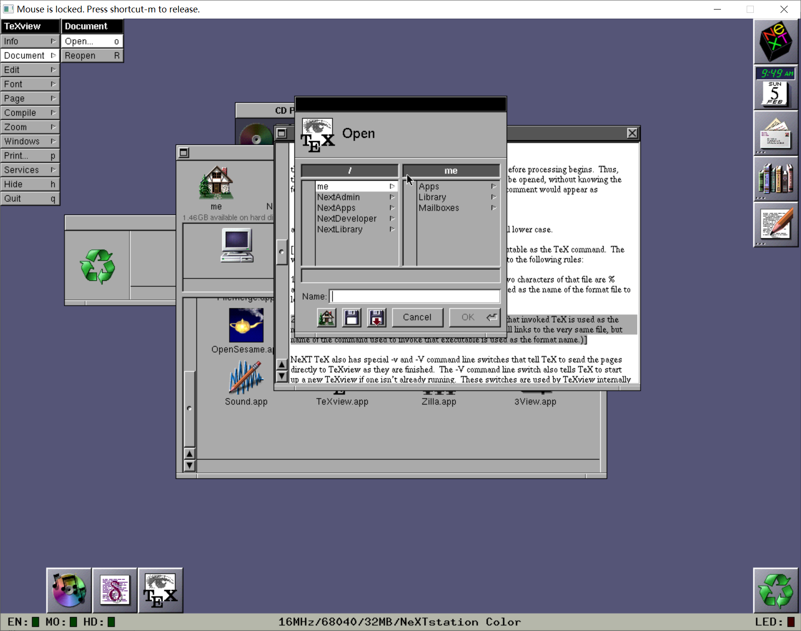

:::note
由于删除了之前存图床的Gitee仓库，部分图像可能已丢失。
:::

在乔布斯被苹果开掉之后，乔布斯自己创建了一个NeXT公司。他先花了十万让一个人画了NeXT的LOGO，然后就开始卖NeXTCube计算机，里面就预装了NeXTSTEP操作系统。

在今天，我们可以用模拟器来模拟NeXTCube，目前只发现了Previous这个模拟器，它可以模拟不同的NeXTSTEP机型，虽然不能模拟网络等驱动，但可以让我们看看那时的NeXTSTEP是什么样子的。

<!--  -->

Previous的鼠标速度有点反人类，所以可以在设置里把鼠标速度调慢。

## 0.9

这是NeXTSTEP相对早期的版本，屏幕是黑白的。左上角是应用菜单，右边是各种应用，右下角是“黑洞”，在接下来的版本被改成了回收站。

让我惊讶的是，里面还有Mathematica这样的应用适配了NeXTSTEP，你可以在里面输入命令，进行各种运算。然后别的就是各种工具，有查字典的，编辑文本的，还有开发的。

你可能觉得也就这样，但当时是1989年，在当时已经特别先进了。麦金塔，Windows完全不能和NeXTSTEP比，这个GUI界面是当时很先进的，比如说很有3D感的界面等。所以在NeXTSTEP也诞生了第一个服务器。

当然，再怎么样的系统也需要能带动它的机器。当时的NeXTCube卖得很贵，1988年的NeXTCube带显示器要6500刀，1900的第二代更是卖到了1万多刀，再加上它的定位是工作站，卖相很差，原本计划卖10000台，但只卖了400台。等到面对家庭的NeXTStation发布，公司才勉强活了下来。

## 3.0

这次的3.0版本终于有了彩色支持，里面的Draw.app也有了彩色选取器支持：

大概是NeXTCube卖相差的原因，这次版本的NeXTSTEP除了原本的m68k平台，还有x86，SPARC，HP的PA-RISC。

NeXTSTEP的图标是当时最高清的，有40x40之多。里面的一些元素甚至用到了动态图标，比如右上角的时间，日历，最小化的文件管理器显示当时文件夹等。整个系统给人的感觉就是现代化，精致，丝毫没有“老”的感觉。

## 参考

[The NeXT Cube](https://lowendmac.com/next/cube.html)

[Cube II](https://www.lowendmac.com/next/nextcube.html)

[Previous](https://github.com/probonopd/previous)

[Winworld:NeXTStep 3.x](https://winworldpc.com/product/nextstep/3x)

[Ebay上的NeXTCube购买页](https://www.ebay.com/itm/Original-BOX-only-for-NeXT-Cube-NeXTcube-computer-Stained-no-Inserts-AS-IS/362589843885?hash=item546c09f1ad:g:dCEAAOSw~gZckCAR)

[NeXT](https://www.wanweibaike.com/wiki-NeXT)

## 其他
>这是本来几周前想写的东西，但由于时间紧张，鸽了很久
>又鸽了
>行了不能再鸽了
