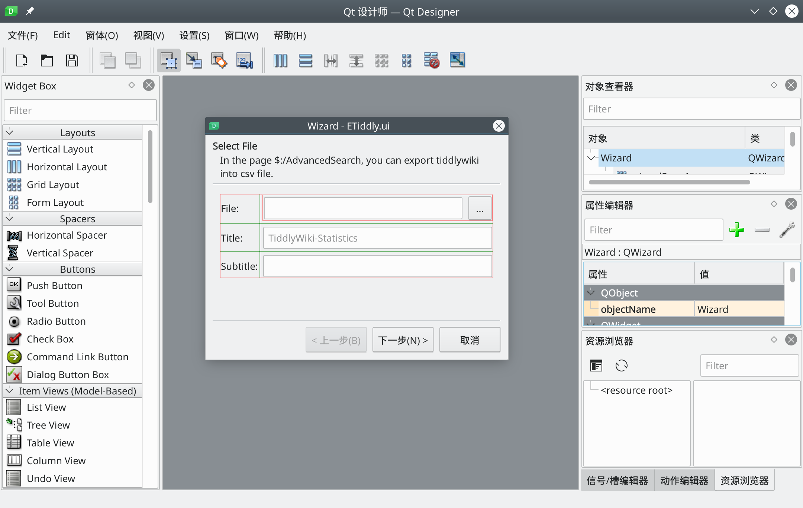

昨天，因为用apt装软件时把很多系统核心组件都删了，现在启动也识别不出设备，只能重装了。

这次又换了Debian 11 KDE，因为最近在弄PyQt5，而KDE是基于Qt的，有原生支持。

安装没什么大问题，跟[上次](../j2021-debian-11/)一样。这里主要说一下体验。

## 体验
这次的fcitx5自带拼音，皮肤也和默认主题一样，输入法终于做到了开箱即用。由于KDE对HiDPI支持不是很好，所以安装完成后需要在设置里设置缩放为200%，之前的150%缩放并不完美，会让某些图标变糊。Debian默认自带两个sddm主题，外观都不是很好，所以还要安装`sddm-theme-breeze`这个包。

KDE版本和GNOME版本一样都有自带软件，不过KDE的某些软件体验很差。比如说Kmail，配置了邮箱，却收不到邮件，~~我最后只能用Thunderbird代替~~，最后这个KMail配置了EWS后终于能用了。自带的KOrganizer的EWS配置也弄了很久，反正配置没evolution-ews简便。

有一个奇怪的问题是无法使用蓝牙耳机，这在GNOME下是没有的，最后解决的方法：

```sh
sudo apt install pulseaudio-module-bluetooth
pulseaudio -k
pulseaudio --start
sudo pactl load-module module-bluetooth-discover
```

最后是一个因为缩放而产生的问题。在特定缩放下，某些应用程序的下半部分会遭到遮挡。GTK程序对此的处理方式是把确定按钮放到顶端，但Qt程序没有Gtk.HeaderBar这种设计，所以下面的确定按钮就会遭到遮挡。在某些程序上这个问题非常明显（比如对话框中的确定按钮）。虽然可以给底部的栏设置自动隐藏，但还是很麻烦。

不过总的来看我对这次KDE的体验满意程度还行，托盘终于能用了，而且终于可以愉快地写Qt程序了。

最后附上KDE上的Qt Designer，终于不用忍受Windows丑陋的界面了，MdiArea也好看了很多。

