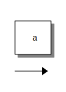
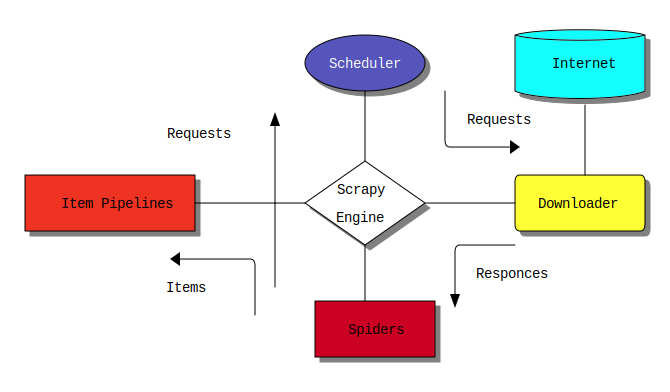
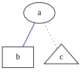
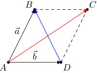

## [Ditaa](https://github.com/stathissideris/ditaa)
这是一个基于ASCII的画图软件，基于Java。

下面是一个画图示例。

```plaintext
+-----+
|     |
|  a  |
|     |
+-----+

----->
```

这样可以生成下面这个正方形和一个箭头。



然后是稍微复杂一点的示例：

```plaintext
                            +-----------+        +------------+
                            |        {o}|        |        c1FF|
                            | Scheduler |        |  Internet  |
                            |       cBLU|        |         {s}|
                            +-----+-----+ |      +------------+
                                  |       |             |
                         ^        |       | Requests    |
              Requests   |        |       |             |
                         |        |       \------>      |
                         |  +-----+-----+               |
+----------------+       |  |           |        /------+-----\
|                |       |  |  Scrapy   |        |            |
| Item Pipelines +-------+--+           +--------+ Downloader |
|            cRED|       |  |  Engine   |        |        cYEL|
+----------------+       |  |      {c}  |        \------------/
                         |  +-----+-----+  /------
               <-------\ |        |        | 
                       | |        |        | Responces
              Items    | |        |        |
                       |     +----+------+ v
                       |     |           |
                             |  Spiders  |
                             |       cC02|
                             +-----------+
```



这个软件是个老软件，在2018年诈尸更新了一下，支持了svg绘图。不过由于中文字体显示比较宽，在等宽字体下显示效果不是很好，所以这个只能当玩具来用了。

org-mode的org-babel原生支持ditaa画图，见[Ditaa Code Blocks in org](https://www.orgmode.org/worg/org-contrib/babel/languages/ob-doc-ditaa.html)

## [PlantUML](https://github.com/plantuml/plantuml)
比较美观，实用的画图工具，和上面的工具一样是基于Java的，可以画流程图等很多图。

下面是用PlantUML还原的一个图。

```plaintext
@startuml
start
repeat
if (是否在列表date里？) then (是)
:将对应数据加1;
else (否)
:添加到列表里，添加数据;
endif
repeat while
stop
@enduml
```

org-babel同样支持PlantUML，见[PlantUML Code Blocks in Babel](https://orgmode.org/worg/org-contrib/babel/languages/ob-doc-plantuml.html)

TODO: {{ab.drawio.svg}}

## [Graphviz](https://graphviz.org)
这个画图软件适合画节点与节点的关系。

```
strict graph {
  b [shape=box];
  c [shape=triangle];

  a -- b [color=blue];
  a -- c [style=dotted];
}
```



## Metapost
这个工具极度依赖$$\LaTeX$$，优点是可以画出任意图，包括几何图，支持$$\LaTeX$$公式。

```
prologues := 3;
outputformat := "svg";
outputtemplate := "%j.%{outputformat}";
verbatimtex
\documentclass{article}
\begin{document}
etex
beginfig(1);
dotlabel.llft(btex $A$ etex, (0,0));
dotlabel.ulft(btex $B$ etex, (1cm,2cm));
dotlabel.urt(btex $C$ etex, (3cm,2cm));
dotlabel.lrt(btex $D$ etex, (2cm,0));
drawarrow (0,0)--(1cm,2cm);
drawarrow (0,0)--(2cm,0);
draw (1cm,2cm)--(3cm,2cm) dashed evenly;
draw (3cm,2cm)--(2cm,0) dashed evenly;
drawarrow (0,0)--(3cm,2cm) withcolor red;
drawarrow (2cm,0)--(1cm,2cm) withcolor blue;
label.ulft(btex $\vec{a}$ etex, (0.5cm,1cm));
label.top(btex $\vec{b}$ etex, (1cm,0));
endfig;
end
```

下面的SVG经过了调整，原版的图片非常小。

