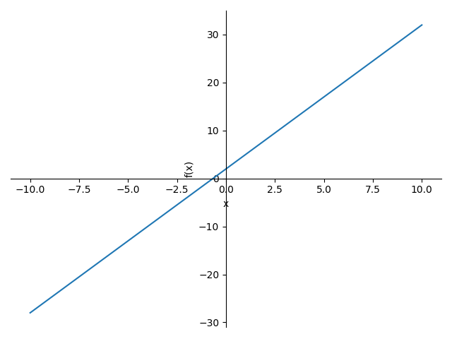

最近了解了一些科学计算库，发现了SymPy这个宝藏。

这个其实就是一个简单的计算器，不过功能还挺多，支持普通方程，一次函数图像等。

## 绘制图像

```python
import sympy
from sympy.abc import x
sympy.plot(x*3+2,(x,-10,10))
```



## 解方程
```python
import sympy
from sympy.abc import x

a = sympy.solveset(sympy.Eq(4 / x - 1 / (x - 1), 1), x, domain=sympy.S.Reals)
print(a)
```

方程为$$- \frac{1}{x - 1} + \frac{4}{x}$$结果会输出一个集合`{2}`，这里其实是两个相同的解。

## 显示为$$\LaTeX$$
直接`sympy.latex(【公式】)`即可。

目前这个库的功能正在挖掘中。
