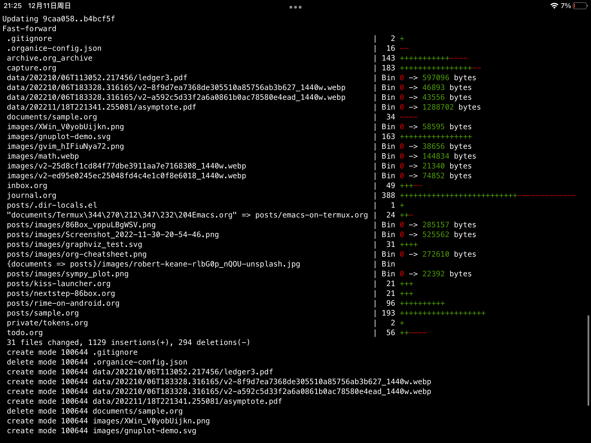

之前在安卓上介绍过[Termux](https://xlbil.netlify.app/posts/emacs-on-termux/)这个安卓上的Shell模拟器，而在iOS平台上也有一个类似的应用，叫iSH。在App Store上的页面可以看到只有一个白色的截图，不看清楚还以为只是一个低级的ssh应用，其实这个应用内置了一个微型的[Linux系统](https://www.alpinelinux.org/)，而且自带了软件包管理器 `apk` 。

## 体验

首先是操作界面。iSH在键盘上增加了 `TAB` `CTRL` `ESC` 和方向键这四个键，不过这个方向键的操作方式很奇怪，四个方向键是并在一起的，在这个按钮上拖动才能操作方向键。这个设计可能是iSH对于终端不支持点击的补偿（原因见“外层”部分）。

iSH默认主题是白底黑字，比较难受，在选项里可以改成黑色主题。里面还有一个选项可以更改iSH的程序图标，有各种用户设计的不同图标，这里推荐TechUpdateGuy设计的图标。

在iOS自带的文件管理器里开启一个选项还可以查看内置Linux的所有文件。

### 应用

在iSH里面运行一些简单的程序还是可以的（比如Python），但是会特别慢，经常会出现执行命令半天没有输出的情况。这个问题似乎在把系统导出再倒入后有所改善。

一些比较普通的应用体验还行。iOS内置的文件管理器是不支持7z文件的解压的，可以在iSH安装p7zip解压。在里面用aria2下载文件也很不错。

而运行一些比较大的软件就体验不好了。在iSH里面的Emacs几乎不可能用内置的package.el安装插件，因为执行 `package-refresh-contents` 根本就没有反应，有时候在Emacs里添加package.el的配置会导致Emacs无法启动。而里面的ffmpeg根本就不能用，如果进行转码操作只会停在那里，速度为0kb/s。

还有一些绘图软件也基本不能用。Graphviz这个软件只能处理非常小的文件，只要这个文件稍微比较大，那么Graphviz就会抛出 `Illegal Hardware Instruction` 错误。

关于iSH里面的性能一直是个谜，在里面运行了 `free` 命令得到的结果是这样：

``` shell
free
```
|       |                |      |        |            |           |     |
|-------|----------------|------|--------|------------|-----------|-----|
| total | used           | free | shared | buff/cache | available |     |
| Mem:  | 0              | 0    | 0      | 0          | 0         | 0   |
| -/+   | buffers/cache: | 0    | 0      |            |           |     |
| Swap: | 0              | 0    | 0      |            |           |     |

可以看到上面显示的全是0，暂时不知道原因是什么。

### 内置系统

iSH不像Termux，由于自己内置了一个完整的Linux发行版，所以软件包的选择比较多，而且和Termux不同，Termux里的软件包是单独放在一个特殊的源维护的，iSH不是这样，所以可以换成清华的Alpine Linux源。

``` bash
sed -i 's/dl-cdn.alpinelinux.org/mirrors.tuna.tsinghua.edu.cn/g' /etc/apk/repositories
```

Alpine源里的默认Emacs是经过阉割的，里面没有自带文档，需要安装额外的 `emacs-doc` 包。

### 其他

iSH还有一个特色功能，支持把目前的Alpine操作系统导出，

接下来的内容就是iSH的问题了。

## 问题

iSH的问题目前看下来特别大。

### 卡顿

虽然iOS以流畅闻名，但是iSH在iOS上的体验并不好。iSH上的应用普遍比Termux上的应用卡。Emacs在iSH上的启动时间也比Termux慢很多。

在调整了 `gc-cons-threshold` 这个变量[^1]的情况下，Emacs的启动还是很慢，启动时间达到了恐怖的33秒。

为了弄清楚iSH的性能，我用秒表给Termux和iSH的应用速度测了速[^2]。在Termux和iSH分别进行以下操作：

- 启动Emacs
- 补全测试（按 `C-h v o RET` ）
- 启动[Eshell](info:eshell)

| 时间   | Termux   | iPhone   | iPad |
|--------|----------|----------|------|
| Emacs  | 00\:20.85 | 00\:36.60 |      |
| 补全   | 00\:01.05 | 00\:03.43 |      |
| Eshell | 00\:01.80 | 00\:06.74 |      |

可以看到在启动时间上iSH里面的Emacs启动速度非常慢，在一些操作上也会耗时更久（尤其是这个Eshell在iSH上能明显感觉到慢）。

当然还有更离谱的时候，就是程序压根就不能运行，结果一直不会显示，有时要按一下按键

### 界面错位

在应用中切换输入法，进行分屏，或者仅仅是进行一些普通操作，都会导致iSH出现卡顿，经常出现的卡顿就是下面这种情况：


这种情况非常常见，经常就是在切换输入法的时候终端上的文字就会错位。在Vim和Emacs里这个问题非常严重。

这还是幸运的情况，如果你很不幸，还会偶尔出现应用黑屏，此时你啥也看不见，只有切换输入法或者其他操作时才能正常。这导致本文在这个应用里的编辑体验非常差。

目前这个问题的改善方案是去掉package.el的配置代码，不过这也说明Emacs不能安装插件了。

### 性能

这个问题是一个大问题，要从两方面来讲。

#### 底层

Termux和iSH的底层其实不一样：Termux是在Android arm架构的基础上构建的。而iSH则是实现了一个模拟器，在这个基于x86的模拟器上面运行Linux系统。

至于不能基于iOS的原因也是无奈之举，因为苹果的封闭性， ~~iSH如果引用关乎系统的组件会导致无法在App Store过审。~~ 即使是基于模拟器iSH也[曾经被App Store下架](https://ish.app/blog/app-store-removal)。

另外一个原因是工具支持。有一个跟iSH类似的应用a-Shell，是基于原生系统的Shell。里面自带的很多工具，但是由于没包管理器，不能选择特定的工具。

#### 外层

iSH的外层其实是基于一个浏览器------Webview，也就是用基于网页做前端。这样总会出现各种各样的问题，比如切换后台时iSH会刷新导致Shell恢复到初始界面。

iSH用的界面是[hterm.js](https://github.com/chromium/hterm)，这个基于网页的实现要支持终端鼠标操作就非常困难了，在Github的Issue里有人提到了这个问题[^3]。目前hterm.js还是不支持点击的。

### 一些小问题

#### 命令执行

在iSH里面有一些问题不影响使用，但是有点奇怪。在里面运行了程序在结束运行后不会直接进入Shell，而是一片空白，需要再按一下回车才行。这个问题在a-Shell也有，可能是iOS自己的问题。

在Emacs上也有类似这样的问题。使用 `M-x` 执行命令时

#### 时区

Alpine Linux默认的时区为UTC标准时间，所以时间会比正常时间晚8小时[^4]，解决方法：

``` shell
apk add tzdata
cp /usr/share/zoneinfo/Asia/Shanghai /etc/localtime
```

先安装tzdata，然后在 `/usr/share/zoneinfo` 这个文件夹里面就会有所有时区的配置。在中国可以复制下面的 `Asia/Shanghai` 文件。复制完之后执行 `date -R` ，如果结尾是 `+0800` 说明时区设置成功了。

## TODO 总结

虽然iSH目前在iOS的体验非常差，而且*小问题*一大堆。但是由于


[^1]: 在init.el添加 `(setq gc-cons-threshold most-positive-fixnum)` 可以加快启动速度

[^2]: 这个结果可能不准确。Termux上的Emacs版本为26.3，运行在Android5。iSH上的Emacs版本为27.1，运行在iOS 15.7.2。

[^3]: 链接：[Github Issue](https://github.com/ish-app/ish/issues/564)

[^4]: 参考[Alpine Linux更改时区](https://www.zhangbj.com/p/1206.html)
