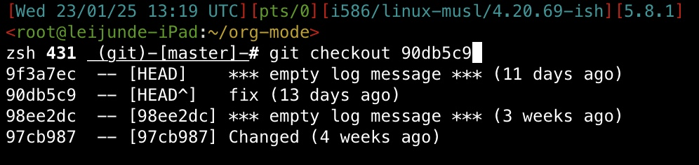

> 此org文件内置的代码可以通过org-mode内置的org-babel-tangle功能取出，见[org-mode文档](info:org#Extracting Source Code)。

之前一直觉得zsh和bash等其他Shell一样，直到最近看了一下zsh的文档才发现zsh的功能非常丰富，可以说是"Shell里面的Emacs"

# 基本设置

## 保存历史记录

在 `.zshrc` 加入：

``` shell
HISTFILE=~/.zsh_history 
SAVEHIST=1000
setopt share_history
setopt hist_ignore_dups
```

其中 `HISTFILE` 用来指定保存历史记录的文件名， `SAVEHIST` 指定保存历史记录的数量。接下来是两个zsh内部选项的设置， `append_history` 可以在zsh内输入exit之后保存历史记录。不过有时候推出zsh的方法并不是这样，而是手动关闭，所以推荐设置 `inc_append_history` 选项，这会让zsh每次执行完命令后保存历史记录。

## 快捷键设置

使用 `bindkey` 命令可以设置zsh的快捷键键位，zsh默认设置的是Emacs键位，也就是：

``` bash
bindkey -e
```

对于熟悉Vim的人可以用Vi快捷键键位，可以用：

``` shell
bindkey -v
```

# 主题

其实zsh里面已经内置了一些主题了[^1]。首先输入：

``` shell
autoload -Uz promptinit
promptinit
prompt -l #列出所有主题
```

最后这个命令可以列出所有的zsh内置主题名称。预览一个主题可以用 `prompt -p 主题名` 。还有一个博客也提供了所有主题的[截图](http://bneijt.nl/blog/post/zsh-themes-for-prompts-screenshots/)。原来使用的是adam2主题，后来使用的是clint。

在Debian Linux上的zsh默认推荐配置会自动设置主题为adam1，不过这个主题并不好看

``` shell
autoload -Uz promptinit
promptinit
prompt clint
```

# 补全

zsh最强大的功能就是补全了，里面对很多软件都有补全支持（在部分发型版需要安装 `软件名-zsh-completion` 包），这也是我在Debian上用zsh的原因。

在zsh默认的推荐配置里就启用了补全。如果手动配置需要启用补全：

``` shell
zstyle :compinit filename "~/.zshrc"
autoload -Uz compinit
compinit
```

然后就可以在很多地方使用补全了。其中git对于zsh的补全支持非常好，对于操作的命令可以在下方显示解释，甚至可以补全每个commit并显示时间，如下图所示：



下面是某些Linux发行版默认的zsh补全配置，比较复杂一些：

``` shell
# Use modern completion system
autoload -Uz compinit
compinit

zstyle ':completion:*' auto-description 'specify: %d'
zstyle

 ':completion:*' completer _expand _complete _correct _approximate
zstyle ':completion:*' format 'Completing %d'
zstyle ':completion:*' group-name ''
zstyle ':completion:*' menu select=2
eval "$(dircolors -b

)"
zstyle ':completion:*:default' list-colors

 ${(s.:.)LS_COLORS}
zstyle ':completion:*' list-colors ''
zstyle ':completion:*' list-prompt %SAt %p: Hit TAB for more, or the character to insert%s
zstyle ':completion:*' matcher-list '' 'm:{a-z}={A-Z}' 'm:{a-zA-Z}={A-Za-z}' 'r:|[._-]=* r:|=* l:|=*'
zstyle ':completion:*' menu select=long
zstyle ':completion:*' select-prompt %SScrolling active: current selection at %p%s
zstyle ':completion:*' use-compctl false
zstyle ':completion:*' verbose true

zstyle ':completion:*:*:kill:*:processes' list-colors '=(#b) #([0-9]#)*=0=01;31'
zstyle ':completion:*:kill:*' command 'ps -u $USER -o pid,%cpu,tty,cputime,cmd'
```

# 其他

## 显示版本控制信息

zsh内置一个 `vcs_info` 模块（在部分Linux发型版上需要单独安装 `zsh-vcs` 包），可以显示版本控制信息[^2]，开启方式如下：

``` shell
autoload -Uz vcs_info
```

输入 `vcs_info_printsys` 可以列出所有支持的版本控制系统，其中如果有一些版本控制系统是不需要的可以用 `zstyle` 命令禁用，比如禁用bzr：

``` bash
zstyle ':vcs_info:*' disable bzr
```

还可以只启用某些版本控制系统，比如只启用git、svn和hg：

``` shell
zstyle ':vcs_info:*' enable git hg svn
```

目前zsh内置的主题只有clint是支持显示版本控制信息的。

## 用cdr命令跳转至最近的文件夹

这是zsh里面的一个很实用的功能。开启方法：

``` shell
autoload -Uz chpwd_recent_dirs cdr add-zsh-hook
add-zsh-hook chpwd chpwd_recent_dirs
```

用 `cdr -l` 可以列出之前去过的文件夹

## 游戏

zsh里面自带一个俄罗斯方块游戏，可以用以下方式开启：

``` shell
autoload -U tetris
zle -N tetris
bindkey '^T' tetris
```

这样就可以按 `Ctrl+T` 进入俄罗斯方块了。如果设置了Vi按键模式，还可以用hjkl来控制方块移动。

zsh也内置了这个游戏的另外一个版本（不能旋转方块）：

``` shell
autoload -Uz tetriscurses
tetriscurses
```

[^1]: 参考链接：[彩色的Shell](https://www.cnblogs.com/bamanzi/p/colorful-shell.html)

[^2]: 参考官方文档：[26.5 Gathering information from version control systems](https://zsh.sourceforge.io/Doc/Release/User-Contributions.html#Version-Control-Information)
