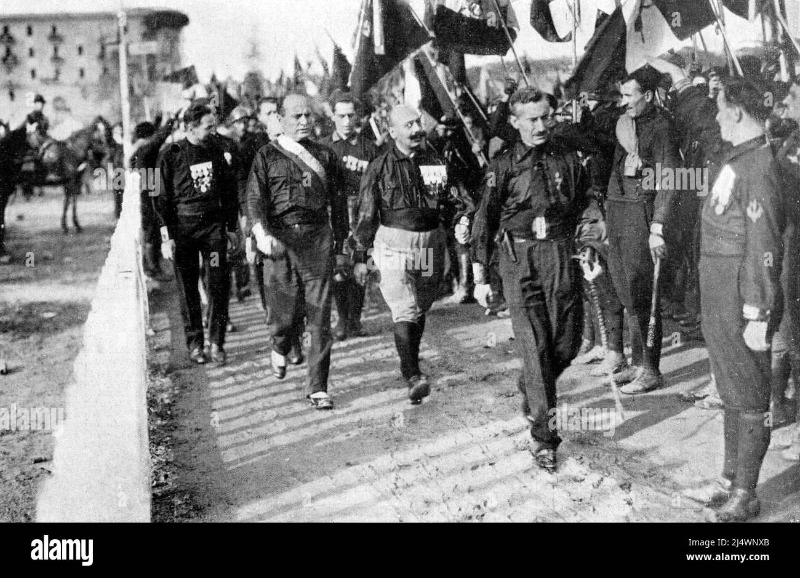
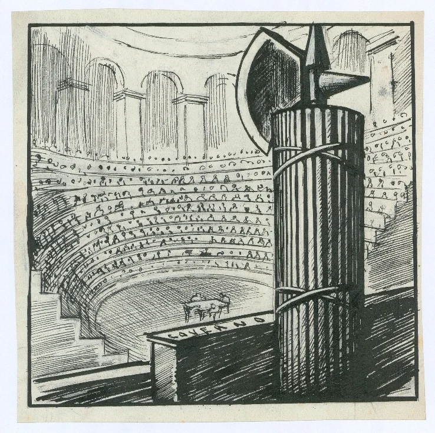
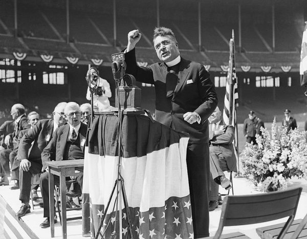
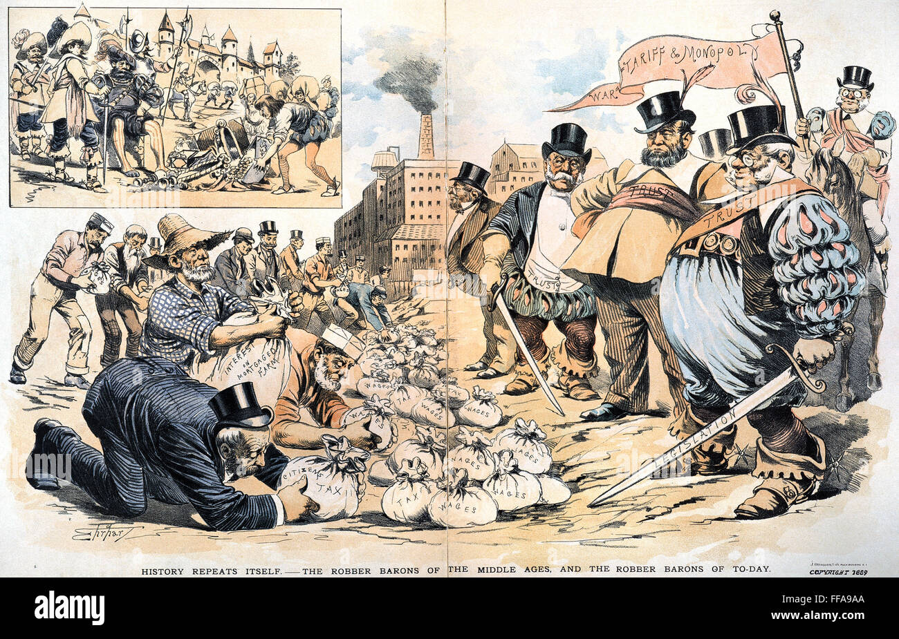
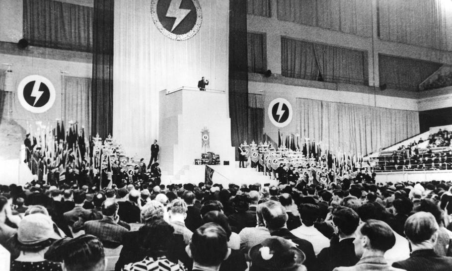

:::important
以下各意识形态和意识形态的介绍来自游戏钢铁雄心4架空世界观模组“新秩序：欧洲末日”（简称TNO），包含基于现实人物的虚构内容，与现实无关，请注意分辨。
:::

:::important
以下内容包含关于法西斯主义、纳粹主义等极端主义内容，但这不代表作者的政治观点，或是宣扬这些思想。这些内容仅仅用于介绍真实历史。
:::

## 法西斯主义（通用意识形态）

> 历数在一战后的动乱中诞生的各路意识形态，唯一在欧洲攫取强权地位并且成功维持下来的意识形态便是法西斯主义。法西斯主义受幻想破灭的共产主义与威权民族主义影响，时常因其所受极左与极右意识形态的启发而被标为“第三位置”。虽然该意识形态的世界观中仍能发掘出一丝马克思主义思想（生产和寄生的辩证对立），但以民族替代了经济阶级——这充满毒害的民族主义思想导致其与社会主义的国际主义思潮相对立，并不可避免地导致了一战之后德国、西班牙与意大利的内部冲突。但法西斯主义党派最终都获得了胜利并埋葬了社会主义反对者。
> 
> 最能强调法西斯主义的特征来源于其推崇的对国家近乎盲从的忠诚。政府通常由某个强人掌控，由他扮演国家的仲裁者与最高权威。宗教机构、工会、私有企业等可能会受许以被限制的形式存在，但他们也必定会奉承国家机关。法西斯政府还会推崇民族传说，讲述一群过去曾光辉一时的优越高贵民族被剥夺了荣誉，并以此要求人民团结一致追回失去的东西。他们会讽刺民主国家守着衰落的尊严不放、社会主义国家则是屈服于落伍退步——但又非常矛盾地将这些国家视为意图夺取或摧毁他们一切珍视之物的威胁。

原图是1922年黑衫军发起的“进军罗马”行动的照片，从左到右的四个主要人物分别为成员*伊塔洛•巴尔博*、*贝尼托•墨索里尼*、*切萨雷•马里亚•德韦基*、*米凯莱•比安基*。

* 伊塔洛•巴尔博（Italo Balbo）是前意大利空军元帅，早年参与阿尔卑斯军团，后成为法西斯运动核心成员，1929年任航空部长期间重组意大利空军，被誉为“意大利空军之父”，同年升任空军元帅后被调离空军，转任利比亚总督至1940年，期间推动当地基础设施建设。1940年6月28日其座机在图卜鲁格上空被意军误击坠毁身亡。
* 米凯莱•比安基（Michele Bianchi）是意大利战斗者法西斯的创始人之一，参与起草该运动早期纲领，在墨索里尼政府担任公共工程部副部长等职务。
* 切萨雷•马里亚•德韦基（Cesare Maria De Vecchi）是黑衫军领袖之一，党内属温和派和保王派，1923年至1928年担任意属索马里总督，也担任国意大利的一些高层职务，在1943年因投票罢免墨索里尼而被意大利社会共和国缺席判处死刑，因此流亡阿根廷，1949年回国加入新法西斯政党，但未担任职务。

## 贵族法西斯主义

> 传统认知中的法西斯形象总与行动派绑定——心怀愤懑的中产者，誓死抗击侵蚀国本的邪恶势力。然则法西斯主义亦可自上而下滋生，源自土地贵族而非赤贫大众。
> 
> 对旧式精英而言，法西斯恰是镇压社会变革的完美武器。这台老迈却强劲的钢铁巨碾，既能夷平腐蚀下等阶层的危险思潮，又能将精英利益浇筑成血脉相连的阶级堡垒。它是粉碎左翼工会运动的断头台，是以凝固血液砌筑的反动要塞——象牙塔在云端睥睨众生，门扉永远拒斥工人阶级的触碰，更遑论群众组织这等包藏共产之心的毒瘤。
> 
> 时光在此倒流。启蒙精神如古国残碑般剥蚀，进步思潮化作史册尘埃。当权贵族对此甘之如饴：这正是他们梦寐的永恒秩序。往昔王权因自由主义与激进主义而崩解，如今借法西斯之躯还魂。二十世纪的重临，或将成就千年不易的血统王朝。

这张图其实是被P过的，这是原图：

原图为1937年英国国王爱德华八世访问德国的照片。这张照片由Georg Pahl拍摄，最左侧为罗伯特•莱伊，右侧为爱德华八世。

罗伯特•莱伊（Robert Ley）为纳粹德国时期的重要政治人物，在1925年加入纳粹党，二战曾任“德意志劳工阵线”（Deutsche Arbeitsfront, DAF）领导人，也是纳粹党重要书籍《纳粹党组织手册（Organisationsbuch der NSDAP）》的作者。1945年被美军逮捕，在纽伦堡审判开庭一周后自杀身亡。

爱德华八世（Edward VIII）为英国国王，于1936年1月即位，因为他决心与美国平民华里斯•辛普森（Wallis Simpson）结婚而在同年12月退位。同时，由于两人的亲德倾向和在1937年访问德国的事件，因此

P上去的人物应为奥斯瓦尔德•莫斯利（Oswald Mosley），为英国法西斯主义者，创立了法西斯组织“英国法西斯联盟（British Union of Fascists，简称BUF）”。1940年，英国政府查禁不列颠法西斯联盟，莫斯利与其他740名法西斯主义者在二战期间被囚。在战后，莫斯利又组建了一个名为“联合运动（Union Movement）”的政党，在1952年发生诺丁山暴动后，莫斯利借此再次参加选举，但得票率仅为4.6%，因此他在竞选失败后前往法国，不再涉足政治。

Wikimedia Commons上的原图：[File:Bundesarchiv Bild 102-17964, Ordensburg Krössinsee, Herzog von Windsor.jpg](https://commons.wikimedia.org/wiki/File:Bundesarchiv_Bild_102-17964,_Ordensburg_Kr%C3%B6ssinsee,_Herzog_von_Windsor.jpg)

## 法团国家主义

> 正如法西斯主义是二十世纪最引人注目的意识形态一般，法团主义是二十世纪最主要的经济制度。虽然这两种制度都经历了重大的变革和演化，但它们往往都是一种原始的权力工具。换言之，是一种维护所认为的美好和真实，并粉碎一切不美好的方式。
> 
> 法团国家主义映照着法团的初衷：由各经济阶级组成机构，其中每个阶级都是社会的基本单位，都被教导只有通过阶级合作而非阶级斗争才能实现最大的利益。资本主义的个人主义只会导致机会主义和自私自利的泛滥，而社会主义的集体主义只会导向激进主义和毫无意义的破坏，却不能提出任何解决方法。而法团国家不同，它带来的是阶级之间的调和与和平，所有阶级都是国家机器中的齿轮。他们摒弃了社会激进主义，转而信奉传统，宁可选择稳定的社会结构，也不愿支持任何可能破坏它事物。
> 
> 经济由以产业为基础的法团组成，同时囊括工人和雇主，这些团体则作为他们在国家面前的代表。在部分人看来，这造就了一个等级分明、谈不上民主的国家；而在另一些人看来，这是一种有机的民主形式，在这种制度下，普通民众的不同利益可以得到充分的接纳，而不像多数派民主那样容易忽视少数群体的需求。尽管法团制度或许带有压制性和极权色彩，但反对的声音往往被淹没在无声的海洋之中。

原图拍摄的是1943年东京的大东亚会议（日语全称：大東亜結集国民大会）。

1943年11月5～6日，在德、意两国败局已定的背景下，日本纠集其占领区的各“独立国”首脑在东京举行的国际会议，目的在于进一步利用占领区的人力、物力和财力继续支持战争。出席会议的有：伪中华民国“行政院院长”汪精卫、泰国首相代表旺·怀他耶功、伪满洲国“国务总理”张景惠、菲律宾傀儡政府总统何塞·劳雷尔、缅甸傀儡政府总理巴莫、流亡新加坡的“自由印度临时政府”首脑苏巴斯·昌德拉·鲍斯作为观察员列席了会议。日本首相东条英机在会上极力鼓吹大东亚各民族 “共存共荣”，共同抵御英美外来势力的重要性，要求各国政府与日本“紧密合作”，共同完成“大东亚战争”，并保证日本将给予各国以“民族自决权”，“尊重各国的独立自主”。会议所发表的 《大东亚共同宣言》再次鼓吹建立“大东亚共荣圈”的必要性和重要性。

原图可以在Wikimedia Commons上找到：[Tokyo conference 1943 tribune.jpg](https://commons.wikimedia.org/wiki/File:Tokyo_conference_1943_tribune.jpg)。从左至右的旗帜代表的政权分别为缅甸（日本傀儡），伪满洲国，汪伪政权，日本，泰国，菲律宾第二共和国（日本傀儡），最后一个旗帜无法识别，可能代表印度。

## 法西斯神秘主义

> 法西斯神秘主义学派由尼科洛·贾尼创立，他花费数年时间对古今哲学、社会和宗教进行了全面分析。多年以来，学派成员不断寻找历史重大事件背后的原因，最终得出结论：国家、经济、宗教、道德与种族问题彼此之间密切关联。因此，必须有某种事物将一切联系起来，拥护至上的善、打倒至上的恶——答案正是法西斯主义。
> 
> 在尼科洛·贾尼看来，法西斯主义不仅是一种政治意识形态，它宣扬对国家的不朽忠诚、对上帝的坚定信仰以及对家人、战友和同胞的绝对忠贞，是一种综合性的价值准则，适用于生命中的每分每秒，甚至取代其他一切社会结构，包括宗教；事实上，基督教的最终形态便是法西斯主义，救世主化身的领袖乃美德之典范，在政治和宗教事务中享有至高无上的权威，而那些骄奢淫逸的神职人员都将被历史彻底抛弃。
> 
> 尼科洛·贾尼曾被学术殿堂与空洞的理论辩论所束缚，但他还是得以在意大利帝国迅速崛起，法西斯神秘主义的重要性更是节节攀升、追随者急剧增加，其教义更是为绝望的意大利人带来了希望：责任取代不定、奉献代替怀疑。随着信徒的增加和势力的扩大，领袖发自内心地露出微笑，每一位新的信徒不但彻底领悟法西斯主义的本质，其身心更是得到升华……

这是原图，作者为马里奥·西罗尼：

马里奥•西罗尼（Mario Sironi）为意大利画家、雕塑家、设计师，艺术流派涉及未来主义和形而上学艺术，其作品包括城市景观系列，并为意大利法西斯政权创作宣传品和壁画，被视为“法西斯革命”的艺术家。

## 法西斯民粹主义

> 国家领袖被供奉于圣坛之上——笑容温暖，能抚慰那些因现代生活缺陷而心生愤怒的人们；溢美之辞，是对就业保障、财富增长与爱国主义的揄扬。对于一些人而言，言语直截了然，便已足够；而对于那些洞悉内情的人来说，这些话语则显得意味深长——它们不断揭露充斥社会的腐败现象，无论是自由主义、马克思主义，或是某些难以言喻的东西。但无论如何，这声音都在向二者保证，只有他们才能解决生活中的问题。
> 
> 这样的领导者不会盲目依赖教条来获取权威。当袖标换成国旗，那就强调法西斯主义的部分要素用以维持道德控制，然后再淡化一些，好发挥某种泛泛的民族热情。他们以民众的支持作为货币，换取政权存续的时间，直到人们将领袖视为国家的化身，两者合二为一。
> 
> 避免具体施政之余，他们常常利用夸张且民粹的言论触及真实或臆想中的不满，以个人魅力顶替实质内容。这通常伴随着大量的腐败、幕后交易和掩盖治理问题的政治噱头——只要能听到领袖的声音，告诉他们一切都会好起来，这一切仿佛都无足轻重。

这是一张美国天主教神父查尔斯•库格林在1936年五月俄亥俄州的克利夫兰市的一个政治集会上演讲的照片。[^2]

查尔斯•库格林（Charles E. Coughlin）是一位在加拿大裔美国天主教神父，1916年被任命为天主教神父。1926年，他成为密歇根州皇家橡树镇“小花圣殿”教堂的牧师。为了应对来自三K党的威胁和为教堂筹集资金，他开始尝试利用电台进行广播。凭借其富有魅力的口才，他的节目迅速走红，到1930年已通过CBS（哥伦比亚广播公司）实现全国联播。

之后库格林广播内容从宗教逐步转向政治和经济，早期以经济民粹主义者形象出现，在1932年坚定支持富兰克林•罗斯福，但罗斯福当选后因未能如愿获得政策影响力而与之决裂。之后他立场立刻转向极端，其言论越来越充满仇恨，公开散步反犹主义言论，同时反对美国参与二战，称其为“犹太人的战争”。在1942年被美国司法部因违反《间谍法》剥夺邮寄权，同时底特律大主教也命令其停止政治活动，之后库洛林便退出了公共视野。[^4]

## 新社会主义

> 大萧条引发的全球经济危机让三十年代的世界政治出现了空前的两极分化。在这强烈的阵痛与对传统政治思想范式的幻灭下，一颗名为新社会主义的种子自工人国际法国支部和比利时社会党的右翼理论家的思想中萌芽而出。
> 
> 新社会主义试图将社会从运行失衡与混乱中解救出来，为社会带来团结与稳定。新社会主义者拒斥马克思主义世界观与阶级观，相反，诸如亨德里克·德·曼恩与马赛尔·戴亚等新社会主义运动的新生代理论家发展和倡导他们独有且自认富有远见的理论概念，诸如“计划主义”和“建构革命”等等。新社会主义主张让民众将执掌国家的权利授予技术官僚集团，让他们发动一次自上而下的革命，以完成激进的社会重构。尽管一眼看去，这种思想与民族主义毫无关联，但新社会主义理论家的专制倾向，以及他们在言论与意识形态上与法西斯暧昧不清的现实，使其很快就会转向民族主义，以此弥合国家结构上的许多裂痕。如此，便能在他们主张的革命中产生严丝合缝的转变，从而过渡并进入到技官主义、计划主义、法团主义和社会主义社会。
> 
> 国际社会主义的释经者苏联已经倒下，新社会主义的时代似乎已经到来。许多被布尔什维主义的惨败击碎了世界观的前社会主义者，以及对轴心国胜利者的停滞与绝望而感到幻灭的前法西斯主义者，都选择转向新社会主义，选择去相信它的承诺，疗愈他们愤恨世道不公带来的痛苦。

这又是一张被P过的图片，原图是这个，修改后的版本将人物和标语放在了两侧：

这是1942年德国占领下的比利时的一张政治宣传画，用于招募比利时法语区的工人为德国工作。上部分为挥舞锤子的工人和挥舞手榴弹的德国士兵，下部分为一个丑化过的犹太人，同时衣服上包含英国国旗、美国国旗和共产主义标志，体现出其反共主义、反犹主义思想。标语为Avec l'ouvrier soldat pour le socialisme，意为“与工人战士一起为社会主义”。

原图可以在Wikimedia Commons上找到：[Avec l'ouvrier soldat pour le socialisme.jpg](https://commons.wikimedia.org/wiki/File:Avec_l%27ouvrier_soldat_pour_le_socialisme.jpg)

## 革命锡安主义

> 自西奥多·赫茨尔和摩西·赫斯以来，所谓“主流”锡安主义最初的目标便是让犹太民族拥有属于自己的土地与民族经济、得到国际社会的接纳——这是上世纪西欧歧视犹太人的结果，他们投身于政治行动的具体原因是需要一个能称之为“祖国”的地方，而当时的欧洲却没有犹太人的容身之处。但是，由于缺乏清晰的道路路线，锡安运动不可避免地走向了分裂。自由派和马克思主义者拥抱锡安主义的原因在于，他们认为自由解放可经由民主或是革命实现。然而，革命锡安主义者则拒绝接受赫茨尔的理念。他们认为，赫茨尔追随者的心态过于被动，只是在等待以色列的到来，却不愿付诸行动。相反，基于对妥拉律法和历史的解读，革命锡安主义认为，犹太民族永远都与以色列地联结在一起，即使以色列早已灭亡，它也活在所有犹太人的血脉之中。为了犹太民族的解放事业，任何极端行为都可以接受，包括流血恐怖：犹太人渴求以色列地，正如渴望爱人一般。
> 
> 革命锡安主义极度异质化，除了极端民族主义和直接呼吁政治暴力之外，其支持者基本没有任何共同理想。大多数革命锡安主义者也不会信奉通常意义上的宗教，但他们深信不疑的浪漫民族主义历史解读本身就已经成为了另一种世俗意义上的宗教。他们中的大多数也同时从欧洲法西斯运动中汲取灵感，其中不少人是意大利法西斯主义的崇拜者。但自五十年代以来，在以色列·埃尔达德的领导下，革命锡安主义运动愈发受到当地弥赛亚思想的强烈影响。它的信徒们如今坚信，他们的目标乃是重建根据其对《圣经》非正统解读而定义的以色列王国——独属于犹太人、中央集权的军事化国度，崭新的第三圣殿将成为犹太民族胜利凯旋的象征。

图片上为犹太复国主义组织伊尔贡的图标。

伊尔贡（הארגון，全称הארגון הצבאי הלאומי בארץ ישראל，意为“以色列土地的国家军事组织”， 缩写为אצ“ל）是一个秘密犹太复国主义军事恐怖组织，1931年至1948年活跃于巴勒斯坦地区，曾策划大卫王酒店爆炸案和代尔亚辛村大屠杀等恐怖袭击，组织后改组为以色列右翼政党赫鲁特党，演变为现在的利库德党。[^1]

左右两侧的רק בך在希伯来语中意思为“只有你/唯有靠你”。

## 圣墓主义

> 圣墓主义得名于贝尼托·墨索里尼在米兰圣墓广场的演说，它是法西斯意识形态的最初形态——彼时国家法西斯党尚未成立，法西斯仍自称为“战斗法西斯”。当时的运动并非一个官僚机构盘根错节的政党，而是一群年轻的政治极端分子与心怀怨愤的一战老兵组成的松散联盟：这些理想时常冲突的人因对社会主义与自由主义的共同仇恨而联合，并随时准备以暴力实现目标。
> 
> 圣墓主义的核心信条围绕社会的革命性改造展开：以法团主义路线重构意大利资本主义经济，摒弃腐朽的资产阶级，通过群众动员与扩张主义重振民族精神。经此革命洗礼的新意大利将由新兴精英集团维系——他们并非来自腐败的资本家或软弱的贵族，而是那些曾在一战堑壕中流血、又在“红色两年”期间亲手镇压工厂与农田中社会主义九头蛇的爱国者。
> 
> 尽管多年来，为迎合中产阶级，更温和的政策逐渐取代了这一革命精神，但圣墓的火种仍在罗伯托·里奇、乌戈·斯皮里托和埃托雷·穆蒂等党内极端分子心中燃烧。随着穆蒂的迅速掌权，它终于重返政治话语的核心。尽管这一意识形态摇摆不定且难以捉摸，但不可否认它在底层民众与军队中极具煽动力，成为遏制社会主义蔓延的利器。唯有时光能见证它能否成功开启民族狂热与阶级合作的新纪元，抑或再度被历史遗忘。

这是一张1919年“进军阜姆”的照片，中间拄拐杖的人为进军阜姆行动的发起者加布里埃尔·邓南遮：

加布里埃尔·邓南遮（Gabriele d'Annunzio），原名加埃塔诺·拉帕涅塔，意大利诗人、记者、小说家、剧作家和冒险者。出生于佩斯卡拉，创作涵盖诗歌、小说与戏剧，代表作为《玫瑰三部曲》。

1919年11月，邓南遮反对意大利政府在国际和谈中所采取的妥协立场，认为承认意大利东北部与南斯拉夫交界处的阜姆城（现克罗地亚里耶卡）的独立，对战胜国意大利来说是一种“残缺不全的胜利”。于是他策动和指挥了一次向阜姆城进军的行动，率兵占领了阜姆城，建立“意大利卡尔纳罗摄政统治区（Reggenza Italiana del Carnaro）”，并在那个“自由王国”当了一年的首领。后来，意大利政府军为执行国际协议，受命把邓南遮指挥下的军团驱逐出阜姆城，邓南遮在身负轻伤之后退出了阜姆城。[^3]

Wikimedia Commons上可以找到原图：<https://commons.wikimedia.org/wiki/File:Foto_Fiume.jpg>

## 企业统制

> 钱能买来很多东西，比如钢铁铸成的亭台楼阁、堆砌成山的金银珠宝、懦弱之人的忠心耿耿，却买不来对暴力的垄断权。也买不来一个国家。至少，现在还不能。
> 
> 尽管寡头企业那取之不尽、用之不竭的资本流通在企业国家的每一根血管之中——其他国家可压根不敢做此想象——政府依然享有特权：哪怕企业的触手早已蔓生至社会的各个领域，其庞大需求亦不可忽视，但它们的欲望与计谋最终还是受制于一位特定领导人的想法。即使私人企业统治了经济与社会生活的方方面面，这国家的巨舵依然仅由一双手来牢牢把握，使众人为了盈利之上的某种目的而努力。不论是劳动力还是资本，都要随那舵手的心意！

这是美国画家Samuel D. Ehrhart在1889年画的一副讽刺资本家的画作，下方标题为：

> History Repeats Itself - The Robber Barons of the Middle Ages, and the Robber Barons of To-day.

标题可译为“历史重演——中世纪的强盗贵族，与今日的强盗贵族。”。“Robber Barons”为历史术语，原指中世纪欧洲横征暴敛的封建领主，后引申为19世纪末美国垄断资本巨头（如卡内基、洛克菲勒等）。[^5]

## 英式法西斯主义（已移除）

此意识形态在`v1.7.0b`更新中被通用的“贵族法西斯主义”意识形态替代。

第一张原图为国王查理斯屋（King Charles House）上的纹章：

在伍斯特战役中，查理二世在1651年9月3日通过此房间出逃。

Wikimedia Commons上可以找到原图：<https://commons.wikimedia.org/wiki/File:Coat_of_Arms_on_King_Charles_House_-_geograph.org.uk_-_4807568.jpg>

这个意识形态的安德鲁•方丹版本的子意识形态的配图又是被P过的。原图为1934年6月7日奥斯瓦尔德•莫斯利领导的英国法西斯联盟在伦敦奥林匹亚举行的大型集会：

这场集会约有10000人参加，其中包括2000名莫斯利的“黑衫军”，集会期间反法西斯主义者混入会场并打断莫斯利演讲，随后遭到法西斯护卫队的暴力驱逐，被称为“奥林匹亚骚乱”（Olympia Riot）。

## 国家工团主义（已移除）

这是意大利艺术家贝内黛塔·卡帕（Benedetta Cappa，1897-1977）在1933-1934年为巴勒莫邮政宫（Palazzo delle Poste in Palermo）会议厅创作的未来主义壁画系列《通信的综合》（Sintesi delle comunicazioni），从左到右的三个作品的名称分别为《陆路通信综合（Sintesi delle comunicazioni terrestri）》，《海洋通信综合（Sintesi delle comunicazioni marittime）》，《空中通信综合（Sintesi delle comunicazioni aeree）》。这些壁画以蓝绿色调描绘了陆地、海洋、无线电等不同形式的通信，将未来主义的科技崇拜与一种空灵、和谐的精神愿景相结合：

她的丈夫菲利波·托马索·马里内蒂（Filippo Tommaso Marinetti）则更加知名，他是未来主义的创始人，1909年在巴黎发表《未来主义宣言》，同时他也是一个法西斯主义者，积极鼓吹并参加一战，从1919年起积极参与法西斯党的活动，在1944年病逝。

Wikimedia Commons上此画作的照片：<https://commons.wikimedia.org/wiki/File:Sala_delle_conferenze_3.jpg>

[^1]: <https://www.qiuwenbaike.cn/wiki/伊尔贡>

[^2]: <https://sballiance.net.au/believe/father-charles-e-coughlin/>

[^3]: <https://baike.baidu.com/item/%E5%8A%A0%E5%B8%83%E9%87%8C%E5%9F%83%E5%B0%94%C2%B7%E9%82%93%E5%8D%97%E9%81%AE/6055610>

[^4]: <https://encyclopedia.ushmm.org/content/en/article/charles-e-coughlin?trk=article-ssr-frontend-pulse_little-text-block>

[^5]: <https://dp.la/item/221dfac366c9c72bc8800f1803c29cd3>
