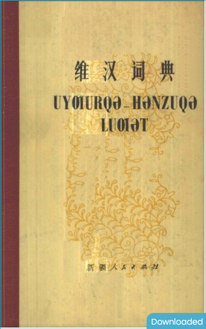

提到维吾尔语的拉丁化，很多人想到的就是现行的方案（示例：Uyghurche），但实际上拉丁维文还有一套完全不同的方案（示例：Uyƣurqə）。

最近在Zlibrary上发现了一本特殊的维汉字典，标题使用的拉丁维文极其特殊：

> Uyƣurqə–Hənzuqə luƣət

作为对比，这是旧维文和拉丁维文的版本：

> ئۇيغۇرچە-ھەنزۇچە لۇغەت
> 
> Uyghurche-Xenzuche lughet

根据[查阅的资料](https://www.qiuwenbaike.cn/wiki/新维文)，这个正字法的正式名称是“新维文”，在上世纪60年代至80年代初使用，1976年被纳入《[少数民族语地名汉语拼音字母音译转写法](http://www.moe.gov.cn/jyb_sjzl/ziliao/A19/201208/t20120821_140823.html)》。在80年代末期老维文被重新使用，新维文便被废弃。

下面是拉丁维文、老维文和新维文的字母表对照：

| 拉丁维文 | 老维文 | 新维文 |
|---|---|---|
| a | ا | a |
| b | ب | b |
| d | د | d |
| ë | ې | e |
| f | ف | f |
| g | گ | g |
| x | خ | h |
| i | ى | i |
| j | ج | j/zh |
| k | ك | k |
| l | ل | l |
| m | م | m |
| n | ن | n |
| o | و | o |
| p | پ | p |
| ch | چ | q/ch |
| r | ر | r |
| s | س | c/s |
| t | ت | t |
| u | ۇ | u |
| w | ۋ | v/w |
| sh | ش | x/sh |
| y | ي | y |
| z | ز | z |
| gh | غ | ƣ |
| h | ھ | ⱨ |
| q | ق | ⱪ |
| e | ە | ə |
| ö | ۆ | ɵ |
| ü | ۈ | ü |
| zh | ژ | ⱬ |
| ng | ڭ | ng |

可以看出，新拉丁维文出现了一音多字的情况，这是因为新维文是中文拼音和突厥语族拉丁字母的混合体，《维汉词典》中提到zh、ch、sh用于汉语人名和地名，相比旧维文较混乱。另外，与旧拉丁文壮文一样，新维文有很多特殊的拉丁字符，在较老的计算机上字体支持较差（如Ƣ字符），因此新维文之后便被更标准的旧维文和拉丁维文取代。