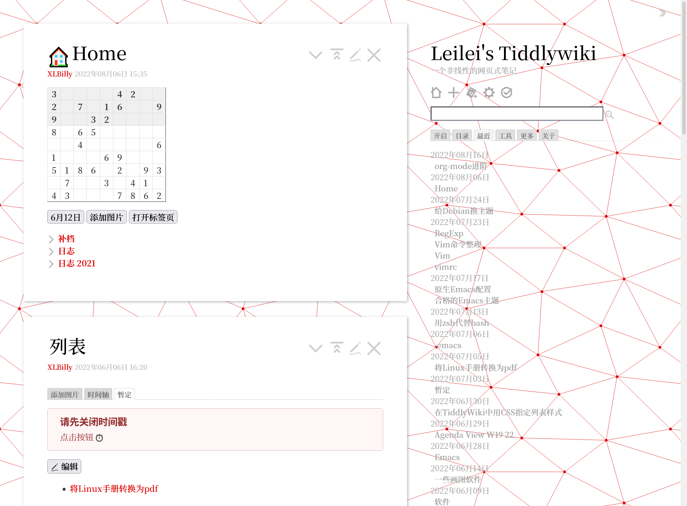

最近整理了一下旧文章存档，将里面的部分文章搬到了博客中公开，并加入了一些注释。在2021至2023年之间，我写了不少文章，但只有在2023年写的文章公开在了与此博客同域名的Hugo博客上，剩下的文章一些曾存在私有的Joplin笔记中，另一些存在一个旧版的（5.2.2）、已废弃的Tiddlywiki中。

* [Joplin 2021年](https://xlbil.netlify.app/tags/joplin%202021补档/)
* [Tiddlywiki 2022年](https://xlbil.netlify.app/tags/tiddlywiki%202022归档/)
* [Hugo 2023年](https://xlbil.netlify.app/tags/hugo%202023归档/)

## Joplin 2021年的文章
我曾把Joplin当作一个存自己写的文章的地方，存储这些文章的Joplin数据目前早已遗失，这些文章之所以能被找回是因为它们作为补档被导入了我在2022年前使用的Tiddlywiki文件。“Joplin 2021”其实概括并不是很准确，因为我曾经有一些文章是写在独立的Markdown文件里的，当时用的软件是Typora+PicGo上传图片，图床用的是Gitee[^1]。

切换至Joplin的原因是它的多端同步功能，以便于在另一台Linux电脑上可以继续写，顺便使用Joplin的附件功能存储图片。在Gitee图床自删和Joplin数据遗失后，由于有些图片在ShareX数据文件夹留下了记录而靠文件名和描述成功恢复，而还有一些图片（如用ScreenToGIF制作的动图）就永远遗失了。

当时写的文章聚焦于各种操作系统的体验，大部分是可从[WinWorldPC](https://winworldpc.com/home)上下载的老旧操作系统。

## Tiddlywiki 2022年的文章
这个Tiddlywiki文件是一个5.2.2版本的Tiddlywiki，在2022年之后就停止使用了。

<!--  -->




由于这个Tiddlywiki仅仅在电脑上使用，而不是像现在这样在Tiddlyhost上用，因此没有文件大小上的担心，里面塞了图片，和一个包含部分[Fomantic UI](https://fomantic-ui.com/)CSS样式的插件。写文章的语法也从Markdown转向Tiddlywiki的独有语法，并大量使用宏。相对于之前写操作系统文章时的无所顾忌插图，在Tiddlywiki上写的时候由于要注意文件大小，插入图片谨慎得多（除非是纯文本的SVG图像）。

由于Tiddlywiki高度自由化的特点，我根据Tiddlywiki原版的Snow White主题定制了一套自己喜欢的主题，这个主题受到极简主义和出版物风格的影响，使用简洁的红、白、黑两色作为主体颜色，背景也使用了一个抽象的几何网格图案；链接动画和分割线样式则照抄两个Codepen。当时我还想做一个暗黑蓝色的版本，但后面因为折腾org-mode就放弃Tiddlywiki了。

## Hugo 2023年的文章
这些文章是我唯一公开的文章，公开于一个Hugo博客，也就是这个站点的旧版本。当时我在尝试使用org-mode写作，搭配[ox-hugo插件](https://github.com/kaushalmodi/ox-hugo)。那个博客使用的是[Eureka](https://www.wangchucheng.com/zh/docs/hugo-eureka/getting-started/)主题，图标用了一个格鲁吉亚SSR[^2]的图标。

ox-hugo这个插件做得特别好，它与org-mode的功能有深度结合，并且对于导出设置和org-mode独有的语法（如说明文字、标题链接、`org-babel`执行结果等）支持非常不错。当时我还在iPad上的[iSH](https://ish.app/)上写文章，这是一个自带Alpine Linux的应用，可以使用此发行版中的各种应用程序，我就在这上面使用Emacs写文章，使用rclone进行同步。

最后放弃的原因是一些硬伤：首先是iSH问题太多，会出现各种各样的小bug，因此我换到了旧安卓手机上，在Termux上的Emacs写。然后就是org-mode的硬伤：对于中文标记支持不佳，这是我放弃使用其写博客的关键原因。

## 现在
在放弃使用org-mode之后，我重新使用了Tiddlywiki。

为了便于在多端写文章，尤其是在iPad上，我一开始用的是tiddlyhost，但它在windows上保存实在是太慢了，因此我使用了[WebDAV保存方式](https://tiddlywiki.com/#Saving%20via%20WebDAV)。博客便被搁置在了一边，文章重新进入了非公开状态。然后Tiddlyhost在Windows上保存慢的bug被修复了，因此我将写文章的地方迁移至Tiddlyhost，和之前不同，第二次使用时我使用了Markdown插件，便于数据迁移，同时安装了从[tw-markdown-more](https://github.com/cdruan/tw-markdown-more)提取的`markdown-it-admonition`插件以支持Admonition拓展语法；为了防止文件增大导致访问过慢，这些文章中没有一张图片。

能够在iPad上写文章后，我还尝试用Apple Pencil在tiddlywiki上写文章[^3],当然体验算不上有多好。同时我还遇到了iPad上页面自动重载导致文章草稿丢失的问题，解决方法是使用Browser Storage插件将草稿自动保存至Cookie中，这样重载后草稿也能恢复，代价是保存后要手动清楚Cookie。

之后我了解到了[Astro](https://astro.build)后就有了重新搭建想法，第一次选的是[cactus](https://github.com/chrismwilliams/astro-theme-cactus)主题，看中的是Admonition支持，但可惜没有中文，第二次选的就是博客现在用的主题[重新编排](https://github.com/radishzzz/astro-theme-retypeset)，同样支持Admonition语法。由于Tiddlywiki的灵活性，我还创建了一个模版来将Markdown文章导出为Astro兼容的格式：

<details>

```text
created: 20251108030618122
creator: XLBilly
modified: 20260105100137721
modifier: XLBilly
revision: 0
tags: 
title: $:/templates/retypeset-markdown
type: text/vnd.tiddlywiki

\rules except dash horizrule
---
title: {{!!title}}
published: {{{ [{!!created}format:date[YYYY-0MM-0DD]] }}}
updated: {{{ [{!!modified}format:date[YYYY-0MM-0DD]] }}}
tags: <$list filter="[enlist{!!tags}] -未完结 -Blog"><!-- 排除未完结，Blog等标签 -->
- <<currentTiddler>></$list><%if [<currentTiddler>has[description]] %>
description: {{{ [<currentTiddler>get[description]] }}}<%endif%><%if [all[current]tag[未完结]] %>
draft: true<%endif%><%if [<currentTiddler>has[slug]] %>
slug: {{!!slug}}<%endif%>
---
`
`
<$view field="text" format="text" />
```

</details>

但Tiddlywiki加载还是太慢了，最近重新使用了[Working Copy](https://apps.apple.com/cn/app/git-client-working-copy/id896694807)这个iOS上的Git应用，发现里面的编辑文本界面还勉强能用，并且有语法高亮、Markdown预览、自动保存、插入图片的功能，一下子解决了Tiddlywiki里的很多痛点，因此目前写博客文章已完全转到Working Copy中。

[^1]: 然后把Gitee图床删了，到了今年直接把Gitee账号删了

[^2]: 即“苏维埃社会主义共和国”

[^3]: 至于证据，看看[某些文章](../emacs-301/)的错字和全角直双引号
